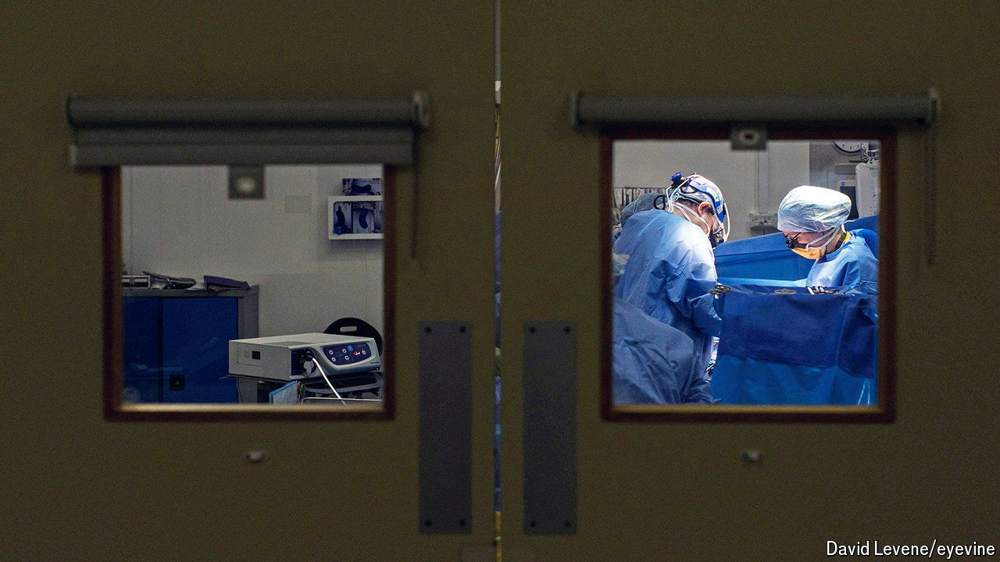

###### Scalpel, please

# The story of one NHS operation 

##### And what it says about how to improve the productivity of Britain’s health service 

 

> Oct 8th 2024 

“WHAT WOULD you like to see?” asks the scrub nurse as a surgeon beside her feeds a wire through a patient’s urethra. It is a Friday afternoon in Theatre 2 at Huddersfield Royal Infirmary in West Yorkshire, and the surgical team is showing your correspondent their equipment. There are tweezers “to take out the specimen”; sponge rollers to soak up the blood. There is the resectoscope, an electrified half-moon wire to burn through bad bladder tissue. “But obviously you can’t see it because it’s in the patient,” she says.

