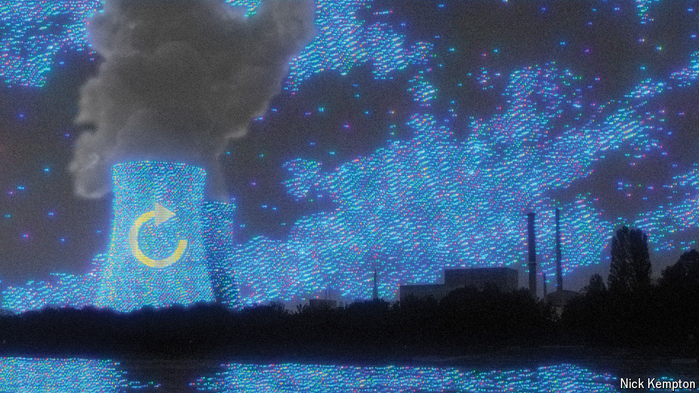

###### Power couple

# Big tech is bringing nuclear power back to life 

##### Artificial intelligence needs clean and reliable energy sources 

 

> Oct 9th 2024 

“Nuclear nightmare”, screamed the headline in  magazine on April 9th 1979. One of the two reactors at a nuclear-power plant at Three Mile Island in Pennsylvania had suffered an accident. The governor ordered an evacuation of all vulnerable people within five miles of the plant as radioactive gas escaped.

