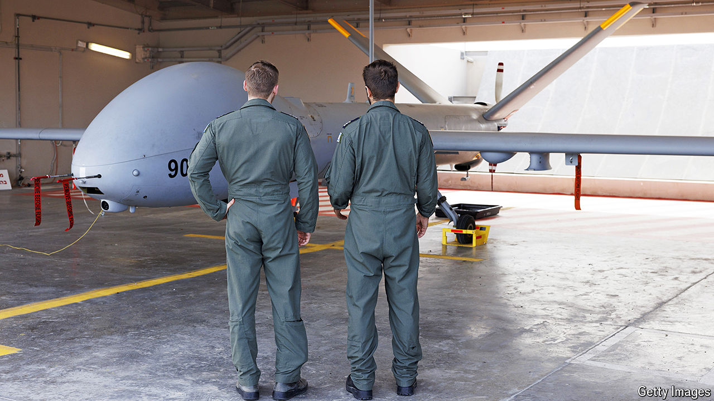

###### Under fire

# Can Israel’s mighty tech industry withstand a wider war? 

##### Its resilience is being tested 

 

> Oct 8th 2024 

Soon after Hamas attacked on October 7th last year, around a third of workers at Elsight, an Israeli maker of drone communications systems, were called up to fight in Gaza. A similar exodus took place across Israel’s tech sector, which accounts for over half of the country’s exports, a fifth of GDP—and a fifth of the reservists in the Israel Defence Forces (IDF).

