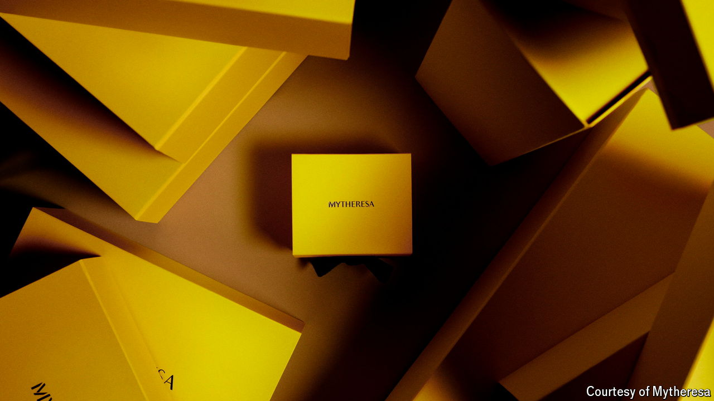

###### A digital makeover

# Can Mytheresa make luxury e-commerce a success? 

##### It reckons it can succeed where Richemont has failed 

 

> Oct 10th 2024 

Not long ago, as consumers emerged from pandemic lockdowns, it seemed the moment for luxury e-commerce had arrived. Cashed-up shoppers, now accustomed to buying almost anything online, were hunting for new outfits to parade in. Online purchases of luxury goods hit €73bn ($80bn) globally in 2022, up from €33bn in 2019, outpacing the already rapid growth of in-store luxury sales, according to Bain, a consultancy (see chart).

