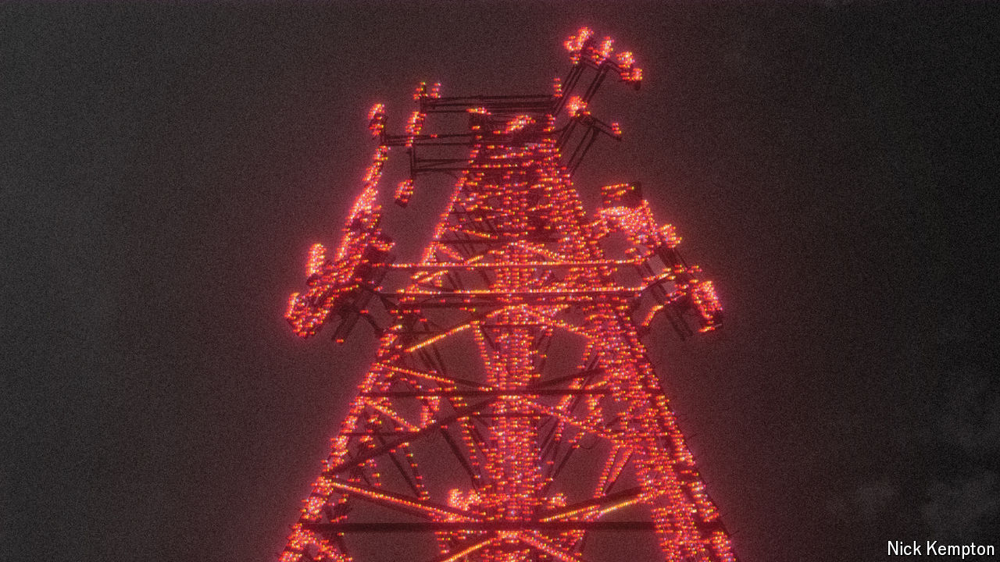

###### The standards war

# China is writing the world’s technology rules 

##### It is setting standards for everything from 6G to quantum computing 

 

> Oct 10th 2024 

A smartphone is a testimony to the power of standardisation. Comprising components from hundreds of suppliers, it can find a signal almost anywhere in the world and connect to a wide array of ancillary devices all because countless companies have subjected themselves to a common set of technical specifications. 

