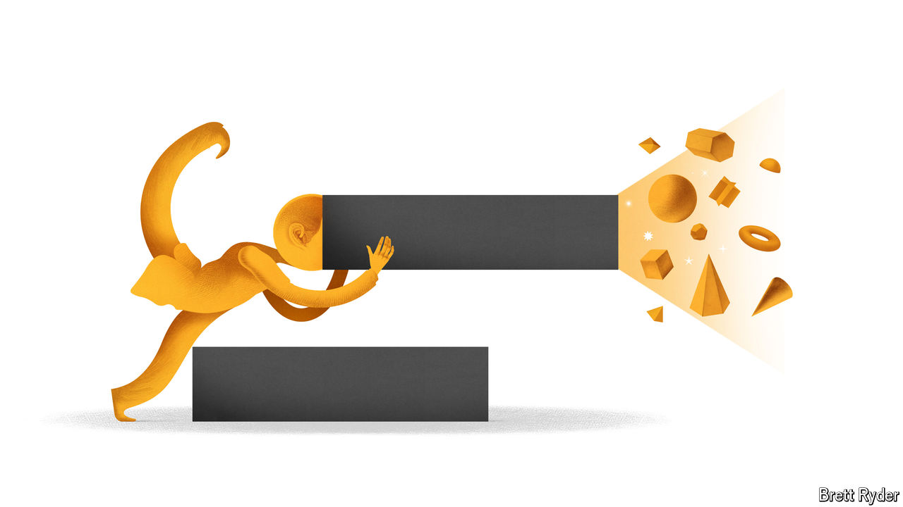

###### Schumpeter

# Masayoshi Son is back in Silicon Valley—and late to the AI race 

##### This isn’t the first time the Japanese tech investor has missed the hot new thing 

 

> Oct 10th 2024 

MASAYOSHI SON is a man of contrasting superlatives. At the height of the dotcom bubble in early 2000 the Japanese technology mogul was briefly the world’s richest person, before losing $77bn in paper wealth, more than anyone before. In 2021 SoftBank Group, his telecoms-and-software conglomerate turned investment powerhouse, reported the biggest annual net profit in the history of Japan Inc, followed a year later by the second-biggest loss. His $20m wager in 2000 on Alibaba, a tatty online marketplace that grew into China’s mightiest e-emporium, counts as one of the best in the annals of venture capital (VC); his later $16bn punt on WeWork, an office-rental startup with tech pretensions, is an all-time dud. He has been called a “genius” and “dumb money”. 

