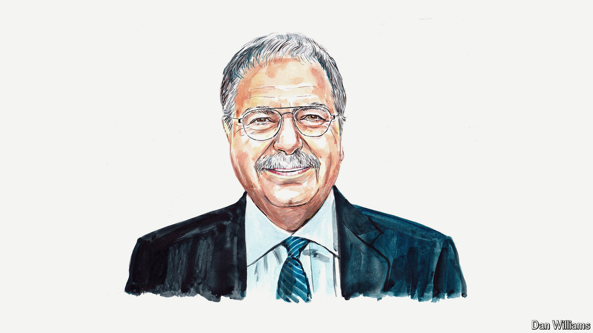

###### The Israel-Hizbullah war

# The framework that ended Lebanon’s war in 2006 could help end this one too, says Tarek Mitri 

##### Lebanon’s former foreign minister says any Israeli plan to reshape the country is a recipe for more chaos 

 

> Oct 10th 2024 

FOR ISRAEL, Lebanon is once again a killing field. Air strikes and now an ever-growing ground incursion have exacted an enormous price from Lebanese civilians. But to see Israel’s stated goal of the complete destruction of Hizbullah as a way toward peace is misguided, because it views Hizbullah through too narrow a lens. Instead there is hope, conditional on American pressure, for a durable ceasefire drawing on the plan that put an end to the war with Israel in 2006 and embodied in UN Security Council Resolution 1701.

