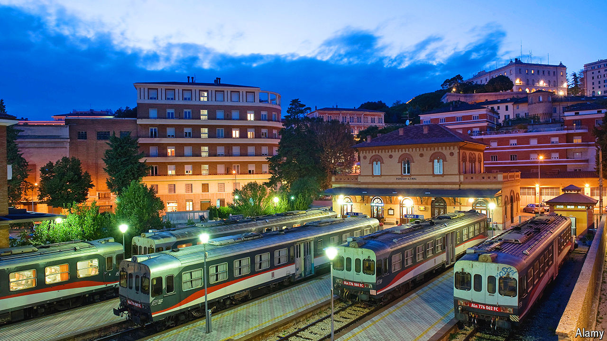

###### A tale of a nail

# Delays on Italy’s spruced-up trains have got worse 

##### Matteo Salvini is making feeble excuses 

 

> Oct 10th 2024 

Britain’s former railway monopoly, British Rail, never truly recovered from the explanation one of its executives gave for disruption to its services in early 1991. He blamed it on a “different kind of snow”, which repetition transformed into a trope: the “wrong kind of snow”. British Rail was broken up and fully privatised six years later.

