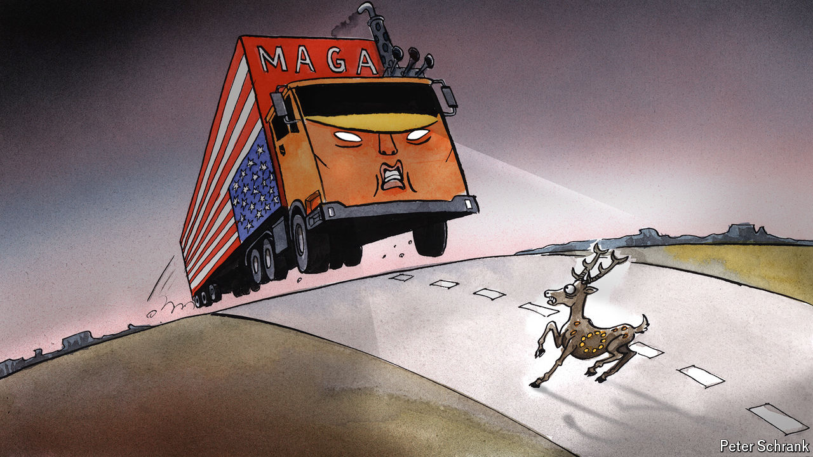

###### Charlemagne

# Europeans are facing the prospect of Trump like a deer caught in headlights 

##### A second dose of MAGA will put the EU in a pickle 

 

> Oct 10th 2024 

Europeans never really took to George W. Bush, whose conservative views, folksy Texan shtick and penchant for ill-advised wars most of them found unappealing. They somewhat warmed to him in January 2017 when, eight years after leaving office, a stray microphone relayed his unfiltered insights into the inauguration speech of a presidential successor. “That was some weird shit,” is roughly how Europeans came to remember not just the rambling address by Donald Trump that January day (huge crowd!), but the four years of bluster and contradiction that ensued. When the mogul-turned-president failed to get re-elected in 2020, relief among Europeans at having survived Trumpism in one piece was palpable. Come 2024 the fear they may yet endure another bout of it is even more so. Vague and belated attempts at “Trump-proofing” Europe have fallen short, as they were bound to. Like a deer caught in a lorry’s headlights, European leaders are left hoping the MAGA juggernaut coming their way swerves, lest they become geopolitical roadkill.

