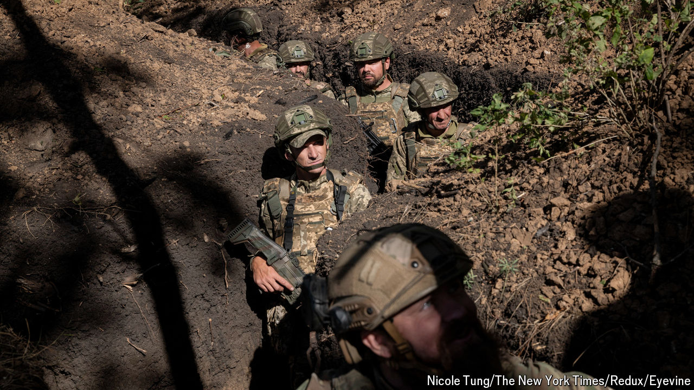

###### Holding on

# Russia continues to advance in eastern Ukraine 

##### But it is encountering growing problems 

 

> Oct 10th 2024 

Now that the excitement of Ukraine’s incursion into Kursk two months ago has faded, the prevailing narrative has reasserted its grip. Ukrainian forces are retreating in the face of steady, if costly, Russian advances across the front line in the Donbas, thanks to Russia’s vast superiority in troop numbers and firepower.

