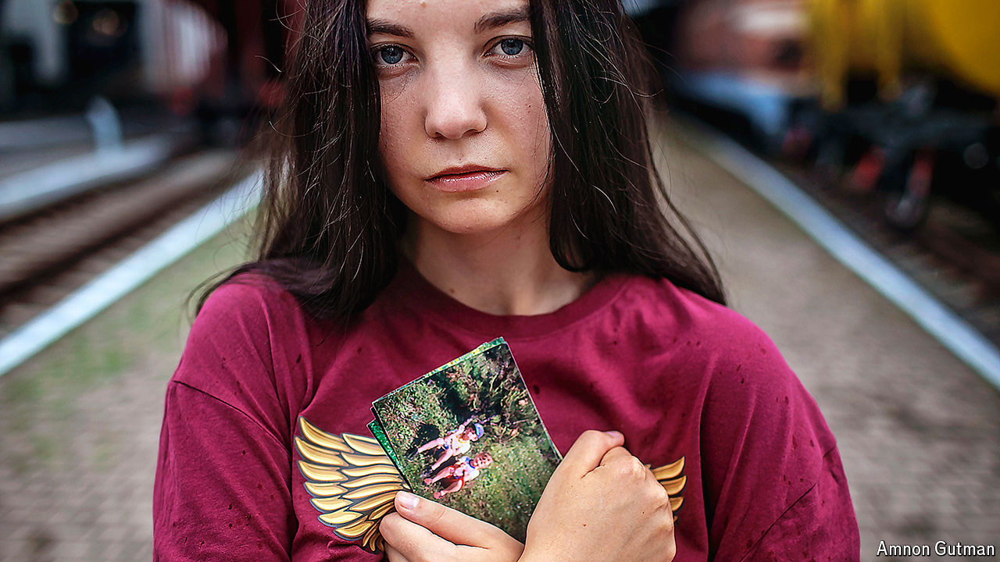

###### Alive or dead?

# The search for Ukraine’s missing soldiers and sailors 

##### The families of missing loved ones are trying to find them, alive or dead 

 

> Oct 10th 2024 

IN A NONDESCRIPT office in a nondescript building in Kyiv, with no sign on its door, four middle-aged men are trawling through gruesome films and photos on the internet. Often they are looking at Russian Telegram channels that specialise in parading captured Ukrainian soldiers. In pictures taken in the past few days one man’s face is running with blood; another has his hands tied but a cigarette is in his mouth. A third, seemingly wounded, is being pushed in a wheelbarrow. These Ukrainian policemen are cyber-hunters searching for Ukraine’s missing soldiers, of whom there are tens of thousands. 

