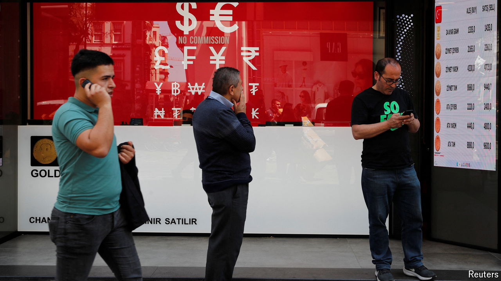

###### Struggling back

# Turkey’s long hard struggle with inflation 

##### High interest rates are starting to do the trick 

 

> Oct 10th 2024 

SETTING interest rates in Turkey is like skiing in pre-lift days. Going down is the easy part. Climbing back up is gruelling, and takes ages. The country’s central bankers have been doing so since the summer of 2023, and they still need more time.

