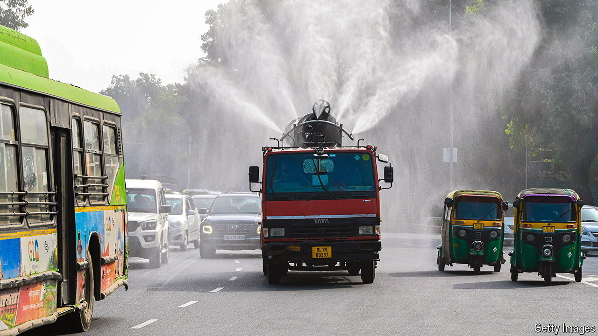

###### When the smoke clears

# Can markets reduce pollution in India? 

##### An experiment in Gujarat yields impressive results 

 

> Oct 10th 2024 

India’s battle with pollution has gone literal. To clean up Delhi’s filthy air, officials now routinely deploy “anti-smog” guns across the capital. The band-aid solution reflects desperation: air pollution, India’s public-health enemy number one, kills around 2m people a year. Recent research, however, suggests that it may be vulnerable to a more abstract weapon: market forces. 

