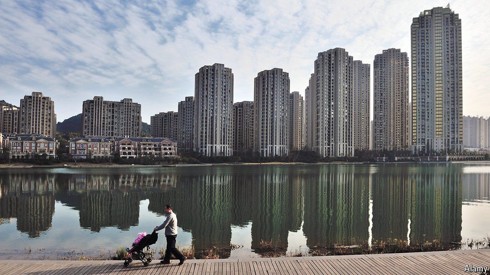

###### Hammered

# China’s property crisis claims more victims: companies 

##### Unsold homes are contributing to a balance-sheet recession 

 

> Oct 10th 2024 

THE FORECLOSURE and court auction of 87 flats in the southern city of Changsha last month underlines many of the problems with China’s property sector. The homes were owned by one woman, flouting the controls that Changsha and other cities have on the number of housing units urban dwellers can buy. The fact that one person was able to acquire so many highlights the backroom dealings that occur frequently. In the past, such speculative activity helped drive up prices and make China’s big cities some of the world’s most unaffordable. The situation, which is under investigation, also shows how rich Chinese often have had few investment options other than apartments. And even these investments now seem shoddy: most of the homes being auctioned in Changsha have gone unsold.

