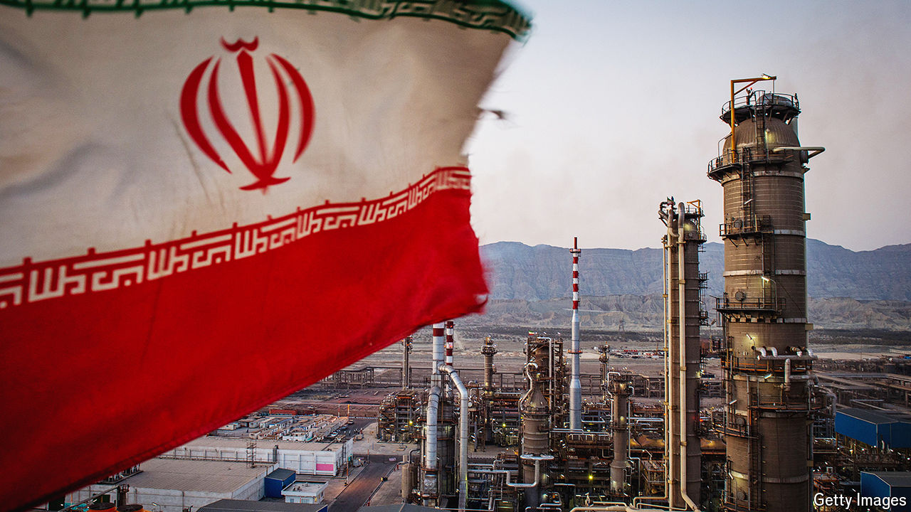

###### Worst-keg scenario

# Could war in the Gulf push oil to $100 a barrel? 

##### Missiles are flying over a region that supplies a third of the world’s crude 

 

> Oct 7th 2024 

EVER SINCE Hamas’s attacks on Israel , the biggest fear in oil markets has been that tensions would escalate into a full-blown regional war pitting Israel against Iran, the world’s seventh-largest producer of crude. Until recently both countries seemed keen to avoid it. That explains why initial jitters on oil markets after October 7th last year soon gave way to the low and stable prices that have prevailed for much of this year. 

