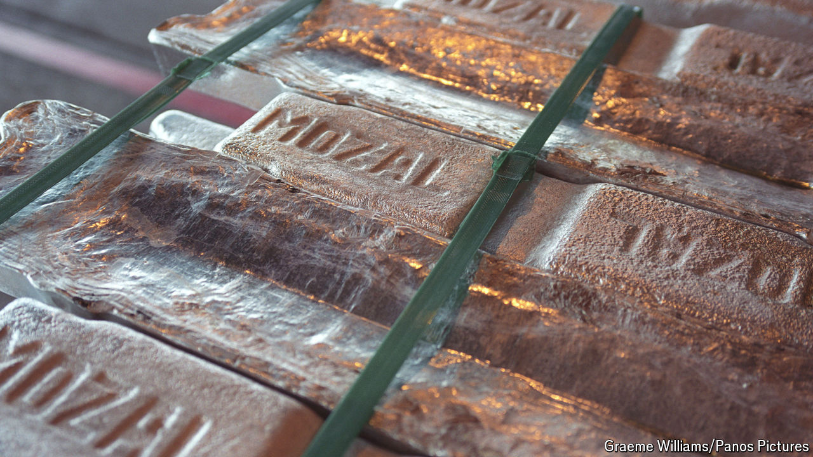

###### C-BAM!

# Europe’s green trade restrictions are infuriating poor countries 

##### Only the poorest can expect help to cushion the blow 

 

> Oct 10th 2024 

WHEN AID donors helped fund the Mozal aluminium smelter in Mozambique, the goal was to help that southern African country build up its economy after a civil war. In a country with income per head of just over $600, the Mozal smelter is the largest industrial employer. Yet now the lofty aim to help poor countries grow risks falling foul of rich countries’ urge to decarbonise their economies and protect domestic manufacturing.

