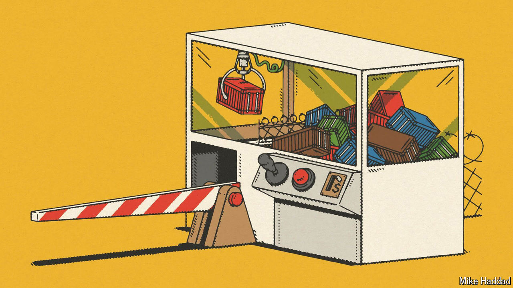

###### The other wall

# How America learned to love tariffs 

##### Protectionism hasn’t been this respectable for decades 

 

> Oct 10th 2024 

ALTHOUGH HIS bill has no chance of becoming law, Jared Golden, a congressman from Maine, delivered an important message last month when he introduced legislation to impose a 10% tariff on all imports into America. It is not just that Mr Golden is the author of the first formal attempt to act on Donald Trump’s proposal for a universal tariff. It is that Mr Golden is a Democrat. His bill is an indication of how tariffs, long seen as an obsolete tool of economic policy, have gained respectability across much of the political spectrum in America.

