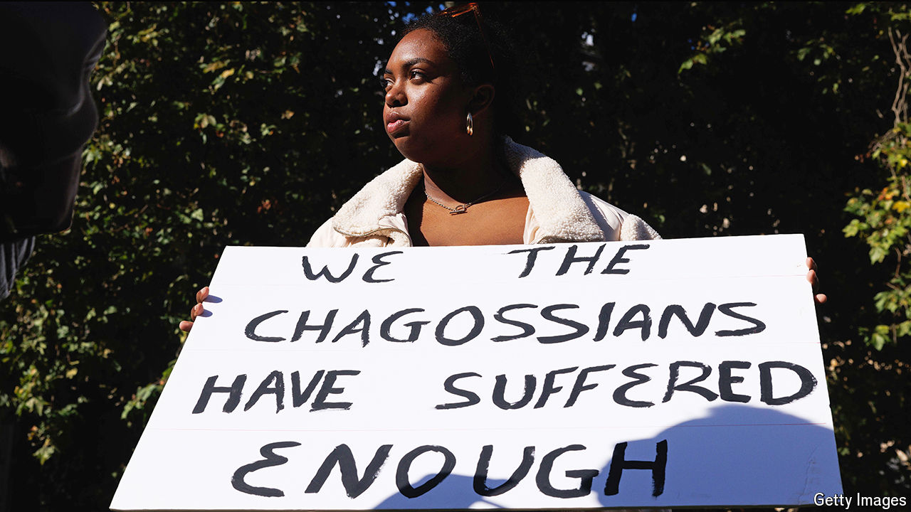

###### A bad deal

# Britain should not hand the Chagos Islands to Mauritius 

##### Once again, the Chagossians have been denied a say 

 

> Oct 9th 2024 

The Chagos Islands are the site of one of the shabbier episodes from the period when Britain gave up its empire. Their 1,500 or so inhabitants, the Chagossians, were forcibly expelled in the 1960s and 1970s to make way for an American military base on the atoll of Diego Garcia. British authorities blocked families returning from trips, cut off the supply of teachers and doctors, gassed the islanders’ dogs and eventually deported anyone still left.

