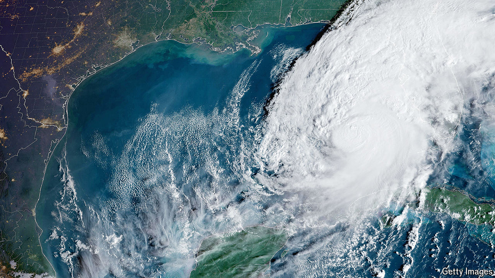

###### Paradise lashed

# How Florida should respond to Hurricane Milton 

##### Storms like it raise uncomfortable questions about the state’s future 

 

> Oct 9th 2024 

The number of deaths caused by Hurricane Milton, which struck the west coast of Florida on October 9th, will not be tallied until days after the storm has swept over the peninsula and headed out into the Atlantic. The amount of damage done will not be clear until well after the waters subside from the areas it flooded. How Florida and other storm-prone places will adapt to climate change is also unclear. But adapt they must.

