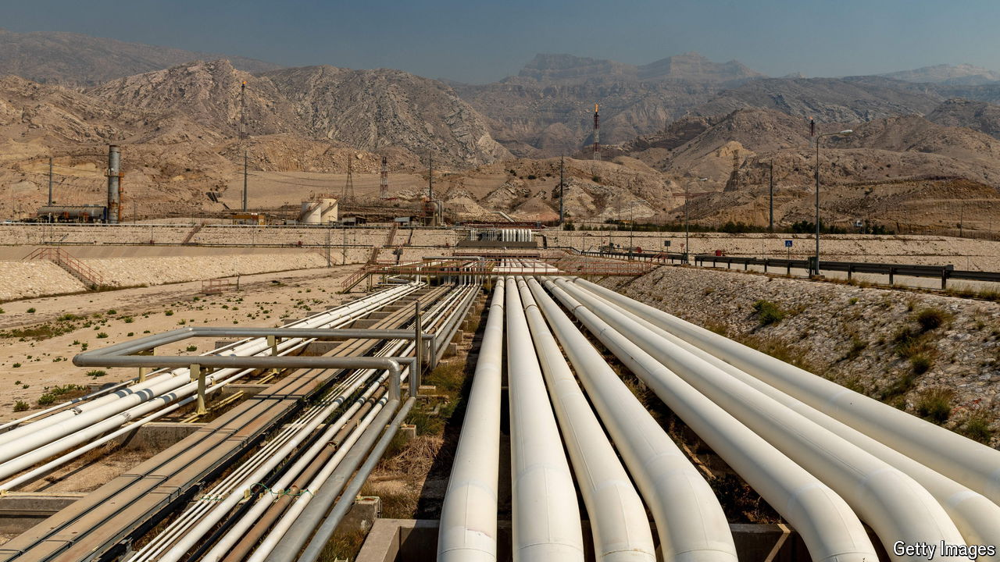

###### Shock horror

# How high could the oil price go? 

##### Geopolitical risk is rising. But so is the supply of oil 

 

> Oct 10th 2024 

All around the world consumers, motorists and politicians are nervously eyeing the oil price. The conflict between Israel and Hamas that began a year ago is spreading. If all-out war erupts between Israel and Iran, the threat to the Middle East, a region that produces a third of the world’s crude, is as obvious as it is scary. Few commodities affect the global economy as much as oil does. And, as America’s presidential candidates are keenly aware, few are as likely to sway an election. The past two years of inflation have shown just how much voters hate sticker shock.

