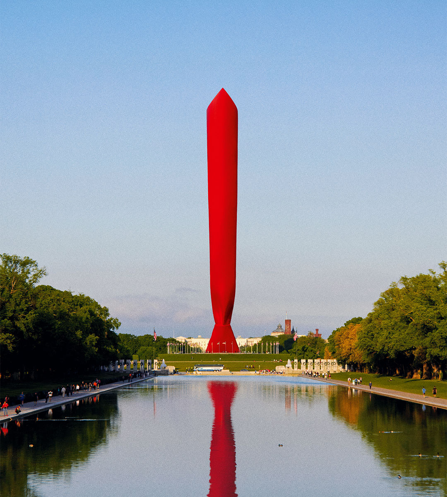

###### An echo and a choice

# The Trumpification of American policy 

##### No matter who wins in November, Donald Trump has redefined both parties’ agendas 

 

> Oct 10th 2024 

THE CHOICE facing America in less than a month will not be made by voters weighing rival sets of policies. Kamala Harris’s plans lack detail; Donald Trump’s are sometimes untethered from reality—and in any case divisions over culture motivate voters more than . Yet the choice matters hugely in policy terms, for America and the rest of the world. This aspect of the election has been under-covered relative to fantasies about what Haitian migrants in Ohio have for lunch. Our current issue, which contains eight concise policy briefs on the areas where we think the election will make the most difference, is intended as an antidote to that.

