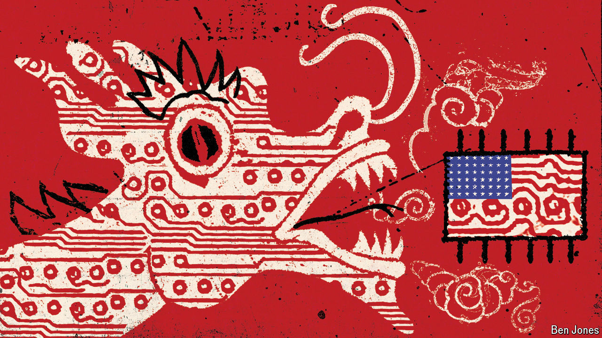

###### A sting in the tail

# The front line of the tech war is in Asia 

##### The two superpowers are vying for influence. China will not necessarily win 

 

> Oct 10th 2024 

A technology tussle between the two superpowers is never far away. This week the  reported a breach of American telecoms networks by a Chinese hacking group known as “Salt Typhoon”, which was seemingly intended to glean knowledge about American wiretapping activities. In both countries, deep mistrust has led to a policy of shunning the other’s digital infrastructure. Uncle Sam bars Huawei, a Chinese firm, from installing its telecoms kit in America; China discourages the sale of Silicon Valley’s servers and cloud-computing products within its borders.

