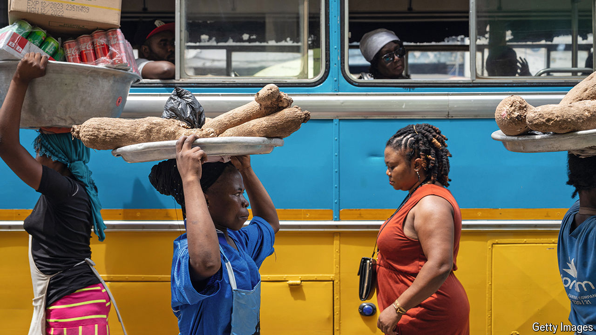

###### Family matters

# How to send a cake from New Jersey to Accra 

##### A Ghanaian app hints at the potential and problems of Africa’s diaspora 

 

> Oct 10th 2024 

Some years ago Christian Kofi Adu Vanlare wanted to buy a “really big birthday cake” for his uncle, the family patriarch, who was turning 88. But there was a problem. Mr Vanlare lives in New Jersey on America’s east coast. His uncle lives in Accra, Ghana’s capital. Icing and sponge do not travel well, and simple things like organising a cake can be onerous in a bustling African city. Various cousins said they were too busy to procure a gateau. 

