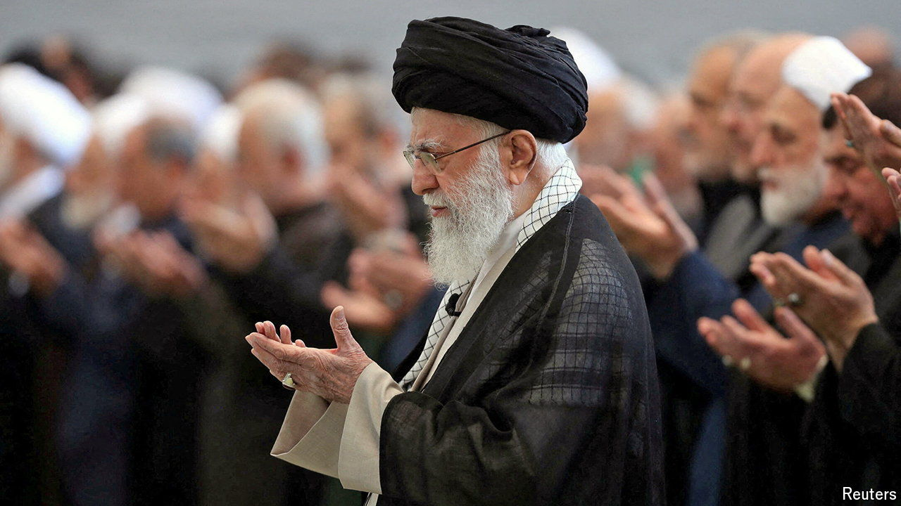

###### Tehran’s calculus

# Iran’s leader must choose how to fight his war with Israel 

##### Hardliners may force the supreme leader to escalate the conflict with Israel 

 

> Oct 10th 2024 

SAFE to say it is not how he pictured his dotage. Ali Khamenei, Iran’s supreme leader, wanted to spend his final years shoring up his creaky dictatorship. Instead he has spent 2024 burying his hand-picked president and approving risky strikes on Israel: hardly a recipe for stability.

