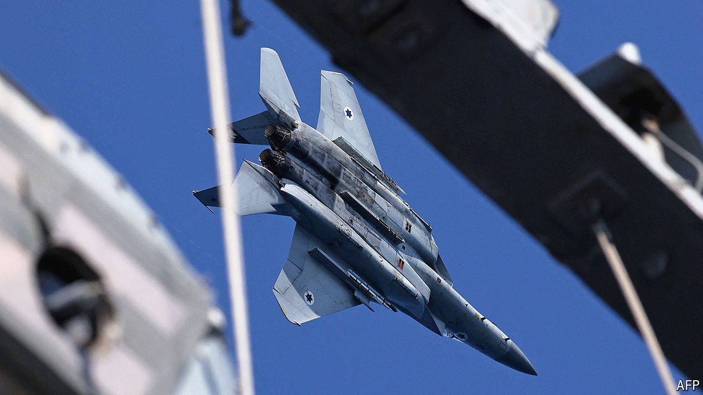

###### War in the Middle East

# Israel has these four options for attacking Iran 

##### Its politicians, and some generals, are gung-ho that the moment has come 

 

> Oct 10th 2024 

At least twice in the past, in 2010 and 2011, Israel’s generals have been ordered by the prime minister, Binyamin Netanyahu, to prepare for imminent strikes on Iran. In both cases the security chiefs questioned the legality of the order, given without the necessary cabinet authorisation. In neither instance did Israel go to war with the Islamic Republic.

