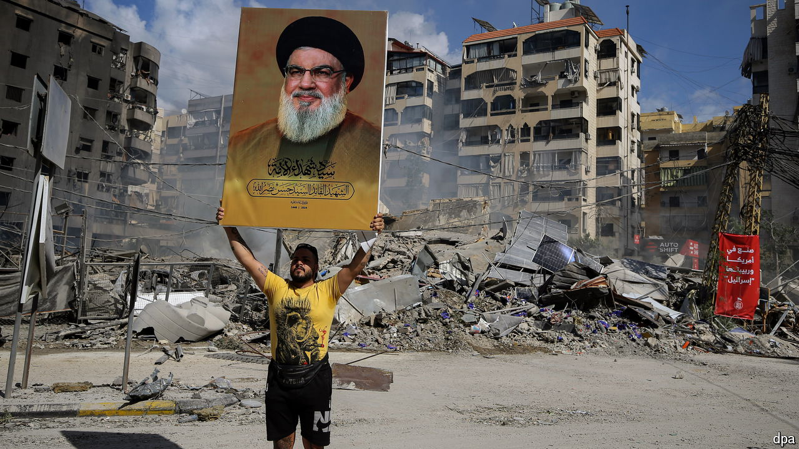

###### Hizbullah’s role in Lebanon

# Israel’s invasion of Lebanon may bolster support for Hizbullah 

##### The group is deeply embedded in Lebanese politics and society 

 

> Oct 7th 2024 

THE BRIGHT yellow flags of Hizbullah that line the highway leading south out of Saida, a port city in southern Lebanon, seem like the standards of a floundering kingdom. Head farther south, where , the Shia militia, holds sway, and the streets grow ever emptier. The only fighters visible are the dead ones staring down from posters. The decapitation, almost overnight, of the Hizbullah’s military leadership, and the assassination of its charismatic leader, , have shocked everyone, not least the Shia group’s own supporters.

