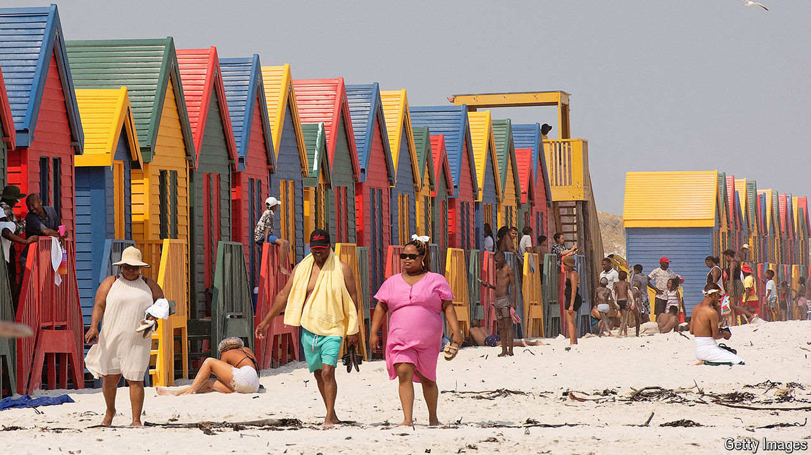

###### Off to a good start

# South Africa’s coalition government has improved the vibes 

##### Now for the hard part 

 

> Oct 7th 2024 

For most of its modern history  has been governed by a single dominant party. The National Party, architects of apartheid, was in charge from 1948 to 1994. After white rule ended the African National Congress (ANC) became the hegemon. Following years of corruption and economic stagnation its pre-eminence was finally checked at general elections in May. The ANC  for the first time, forcing it to form a  to stay in power. 

