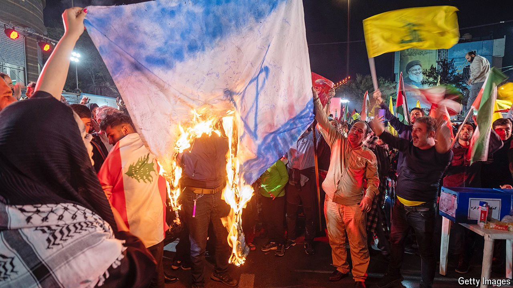

###### Waiting for war

# The threat of an Israeli attack is reviving Iranian nationalism 

##### Iranians fear their country is being dragged into war 

 

> Oct 10th 2024 

In a teahouse in southern Tehran, the poorer half of Iran’s capital, a female storyteller regales a roomful of shisha-puffing men with tales from Persia’s ancient epic, Shahnameh. “He didn’t want war,” she tells them of its warrior hero, Rostam. “He did everything to avoid it, but they kept provoking, and then they forced him to fight.”

