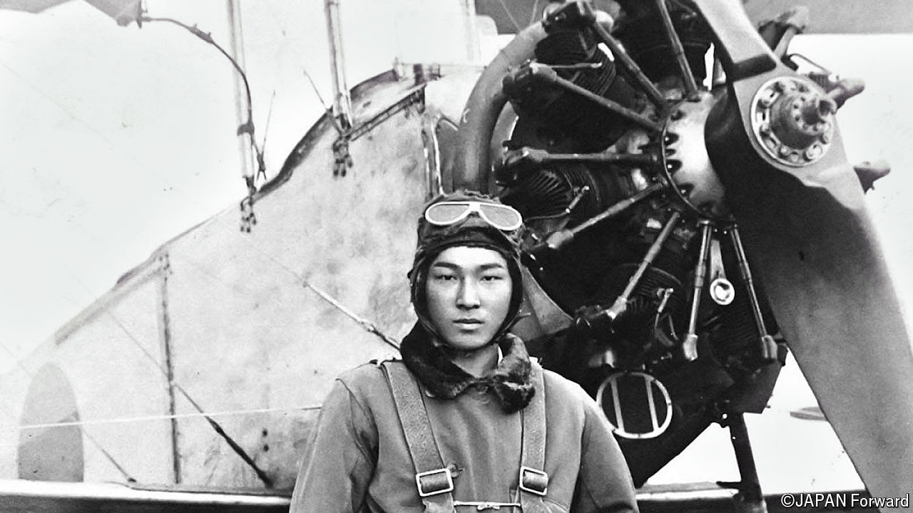

###### Two towers of white spray

# Yoshioka Masamitsu saw Pearl Harbor from the air 

##### The last of the attackers on the “day of infamy” died on August 28th, aged 106 

 

> Oct 9th 2024 

As he SLID into his bunk in the aircraft-carrier , on the night of December 6th 1941, Bombardier Yoshioka Masamitsu was struck by a thought. He didn’t have much time left, because tomorrow he was likely to die. He would die in Hawaii, because that was where Japan had decided to hit America. Such an attack would unleash a gigantic war. Of course it was an honour to be chosen for this mission, and his parents would be proud of him if he died that way. But he was 23, and the thought made all the blood drain from his head. Other crewmen and bombardiers might stoically turn on themselves the pistols they had been issued with, in case they were captured by the enemy. He had a pistol himself. But death did not appeal to him at all. 

