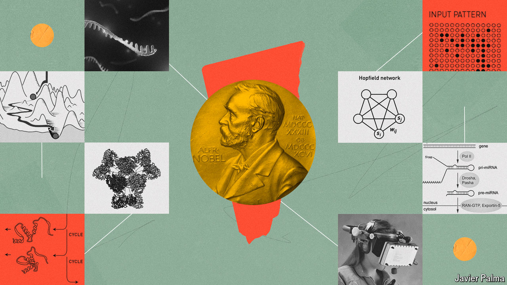

###### The 2024 Nobel prizes

# AI wins big at the Nobels 

##### Awards went to the discoverers of micro-RNA, pioneers of artificial-intelligence models and those using them for protein-structure prediction 

 

> Oct 10th 2024 

The scientific Nobel prizes have always, in their way, honoured human intelligence. This year, for the first time, the transformative potential of artificial intelligence (AI) has been recognised as well. That recognition began on Tuesday October 8th, when Sweden’s Royal Academy of Science awarded the physics prize to John Hopfield of Princeton University and Geoffrey Hinton of the University of Toronto for computer-science breakthroughs integral to the development of many of today’s most powerful AI models. 

