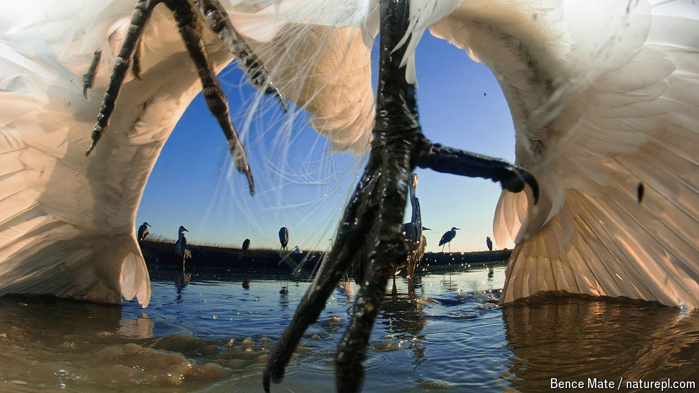

###### Flying fish

# Meet Japan’s hitchhiking fish 

##### Medaka catch rides on obliging birds, confirming one of Darwin’s hunches 

 

> Oct 10th 2024 

THE JAPANESE picture book “Soratobu medaka” tells the extraordinary tale of tiny stream-dwelling fish called medaka hitching a ride on an obliging bird to a far-off freshwater pool. The story has delighted children in the country since 1999, when it was first published, but now comes an even more delightful twist: it is true. 

