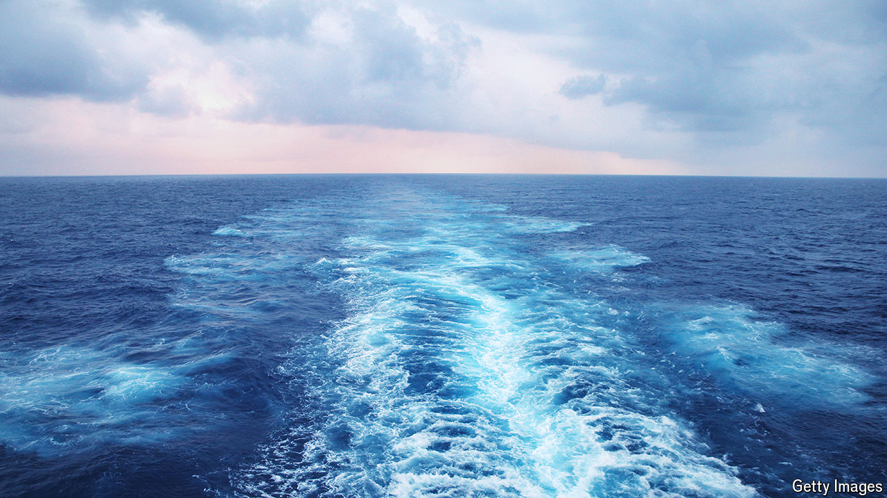

###### Still waters

# Noise-dampening tech could make ships less disruptive to marine life 

##### Solutions include bendy propellers and “acoustic black holes” 

 

> Oct 10th 2024 

MORE THAN 1,000 metres below the surface of the oceans, darkness reigns. For animals living in this perpetual twilight, vision is irrelevant; acoustic signals, instead, are how they navigate, communicate and search for food.

