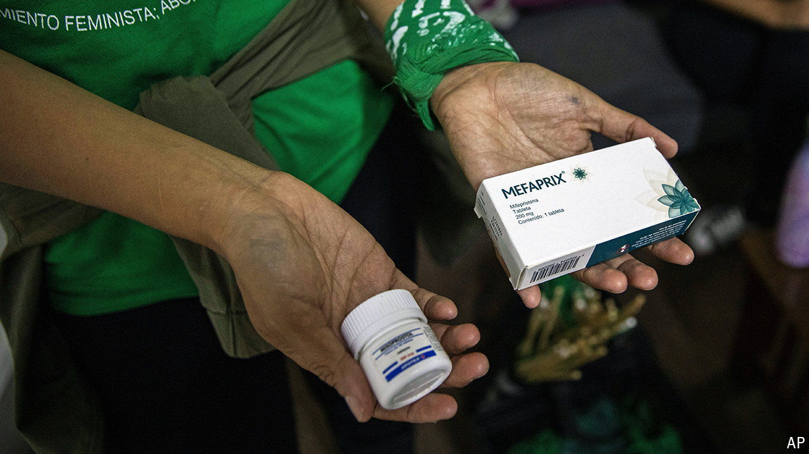

###### Not the end of it

# American women go to Mexico for abortions 

##### They are more readily available than in the past but no less controversial 

 

> Oct 10th 2024 

Mexico has long been a popular destination for Americans seeking nose jobs or dental work. But since 2022, when the United States’ Supreme Court overturned , thereby removing the constitutional right to abortion, American women have started heading south to terminate unwanted pregnancies. That they can do so is testament to a recent expansion of the right to an abortion in Mexico, a trend that is mirrored across Latin America.

