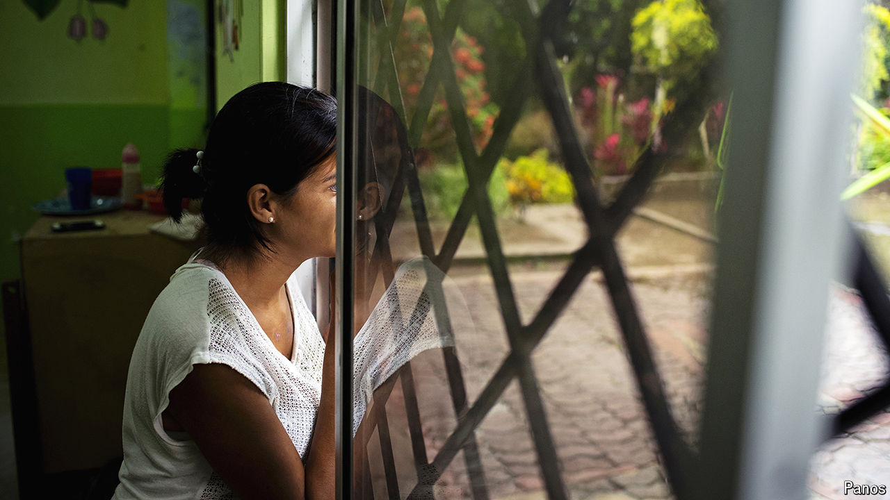

###### Stubborn brutality

# The beating of Argentina’s former first lady fits a shameful pattern 

##### Progress against the scourge of violence against Latin American women has been patchy 

 

> Oct 10th 2024 

On October 1st Mexico’s first female president, Claudia Sheinbaum, was sworn into office. Flanked by female soldiers, she declared that it was “time for transformation” and “time for women”, before sending a raft of bills to Congress designed to improve their lot. Meanwhile, at the other end of the continent, Argentina’s former president, Alberto Fernández, has been accused of domestic abuse in a case which has shocked the region. Photos found on his secretary’s phone showed his former partner, Fabiola Yañez, with bruises on her face and body. Leaked audio files appear to capture Mr Fernández telling the former first lady to “go to hell, you and all your offspring, you dumb bitch”. Mr Fernández denies all charges.

