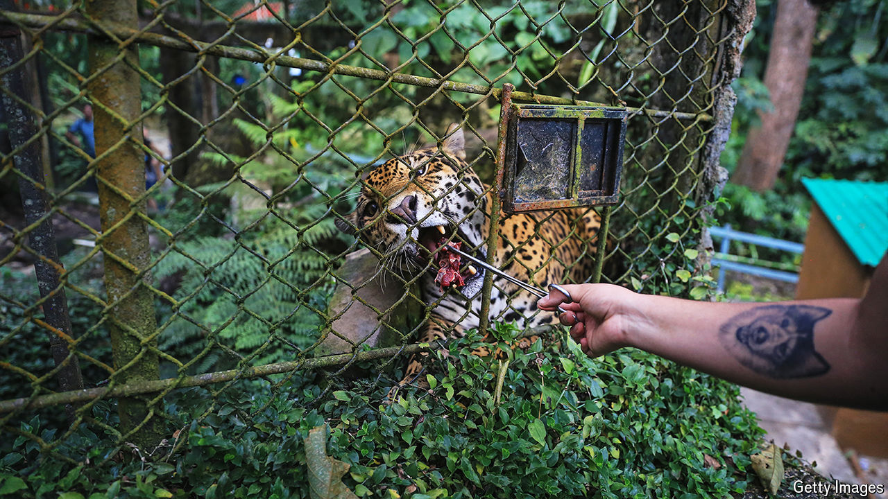

###### Conservation in Latin America

# The drug lords’ side-hustle: smuggling macaws, jaguars and frogs 

##### Illegal trade in wildlife thrives in the world’s most biodiverse region 

 

> Oct 10th 2024 

Hyacinth macaws, blue and vast, a metre long from tail to beak; the jaguar, stocky and muscular, whose ancestors crossed the Bering Strait a million years ago; sloths, the slow, weird-looking tree-dwellers. Latin America is home to a dazzling array of creatures. Some 40% of the world’s species are found between Mexico’s deserts, the Amazon rainforest and the mountains of Patagonia. 

