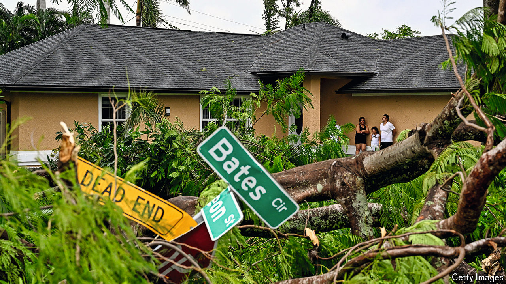

###### The world this week

# Politics 

#####  

 

> Oct 10th 2024 

More than 5.5m people in Florida were told to evacuate ahead of , the state’s second giant storm in two weeks. Milton was recorded as the strongest hurricane to cross the Gulf of Mexico since 2005. It lost some of its punch by the time it hit Florida’s west coast but still packed winds of 120mph (193kph). The biggest threat to coastal towns came from storm surges, predicted to reach 12 feet (3.7 metres) in some places. 

