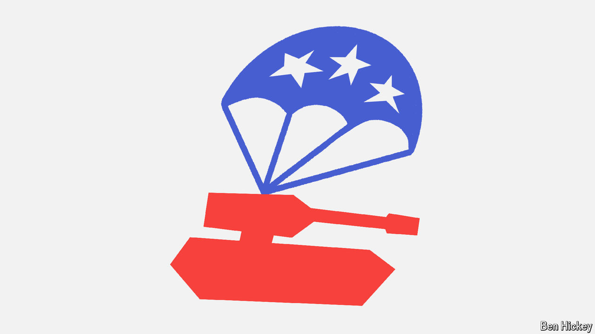

###### Policy brief

# America’s presidential election marks a fork in the road for Ukraine 

##### If Republicans take power, Kyiv will feel a chill: the latest of our policy briefs 

 

> Oct 9th 2024 

Volodymyr Zelensky, the president of Ukraine, visited America in September to speak at the United Nations and present a “victory plan” to his American patrons. The trip did not go well. Mr Zelensky criticised Donald Trump and enraged Republicans by appearing alongside Democrats at a munitions factory. And Biden administration officials were underwhelmed by his proposal to end the war. 

