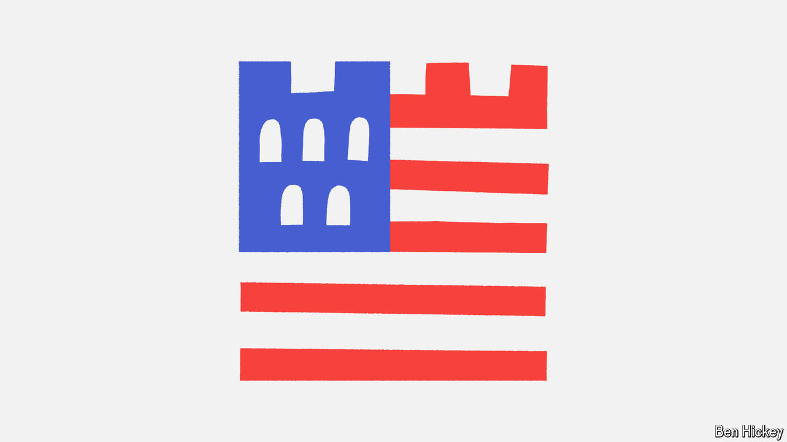

###### Policy brief

# Both candidates pledge to fortify America. How big will they go? 

##### Hawks in Congress want to raise America’s defence budget dramatically, but the next president will decide 

 

> Oct 10th 2024 

Presidential elections don’t often turn on debates about defence spending, in part because funding the armed forces is one of the few bipartisan traditions left in American politics. Donald Trump and Kamala Harris have both issued vague commitments to strengthen the army, yet neither has offered much detail. The terms of debate are already being set on Capitol Hill, however, and the next president could negotiate with Congress to reshape the Pentagon’s future.

