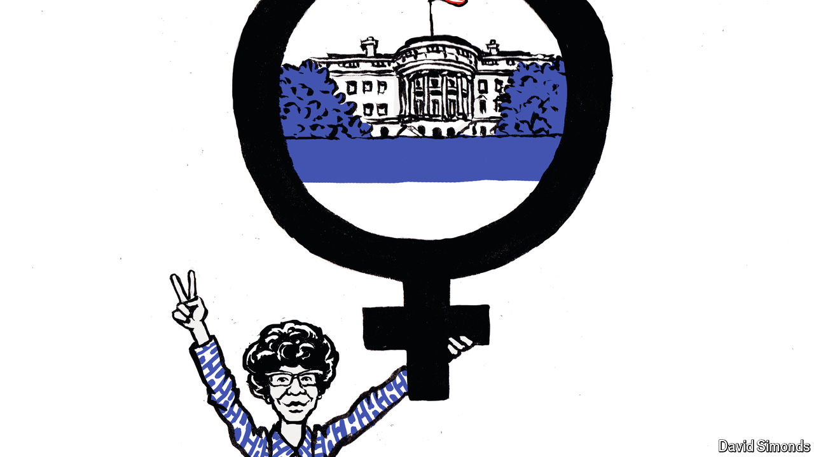

###### Lexington

# Shirley Chisholm is still winning 

##### The first black woman to run for president taught a lesson in making political change 

 

> Oct 10th 2024 

A cynic might gaze at the photograph and sigh that nothing changes in American life: a black woman, a candidate for president, stands before a crowd with a determined look on her face, above a poster extolling a woman’s right to choose abortion. “Defend the Right,” it reads in part. The photograph, in black and white, is from 1972. It hangs in an exhibition at the Museum of the City of New York about Shirley Chisholm, the first black woman to seek the nomination of a major party. 

