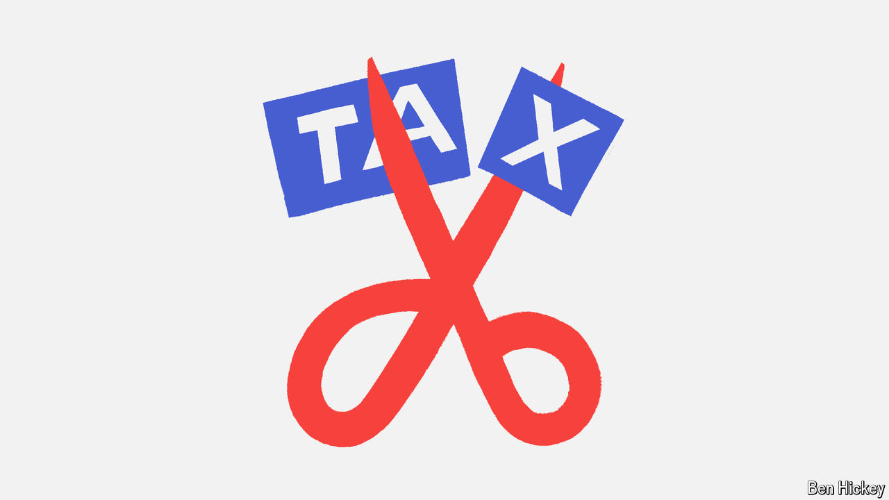

###### Policy brief

# The US tax code will change next year; the presidential election will determine how 

##### Donald Trump promises cuts galore, while Kamala Harris would target the middle-class 

 

> Oct 7th 2024 

NOT ONLY are taxes one of the only certainties in life, they are also one of the only certainties in this presidential election. That is because of the looming expiration of tax provisions passed in 2017, the main legislative accomplishment of Donald Trump’s term in the White House. This presents a fiscal cliff. By the end of 2025 whoever is president must sign new rules into law, or most Americans will see sharply higher income taxes.

