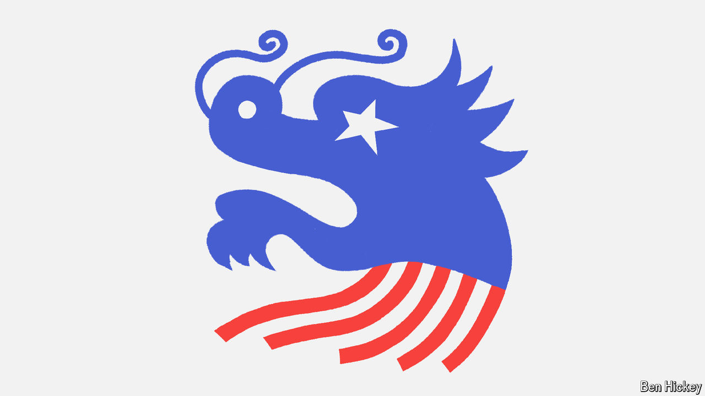

###### Policy brief

# The next American president will be a China hawk 

##### Donald Trump may seek to decouple America’s economy, while Kamala Harris favours more targeted pressure 

 

> Oct 10th 2024 

ALTHOUGH BRITAIN still claims to have a “special relationship” with the United States, no country could contest China’s claim to have the most important one. America’s next president will have to take stewardship of the bilateral relationship at a time when mutual animosity and distrust are high. He or she will have to steer carefully to avoid fracturing the global economy or, much worse, plunging two of the world’s military superpowers into an armed conflict.

