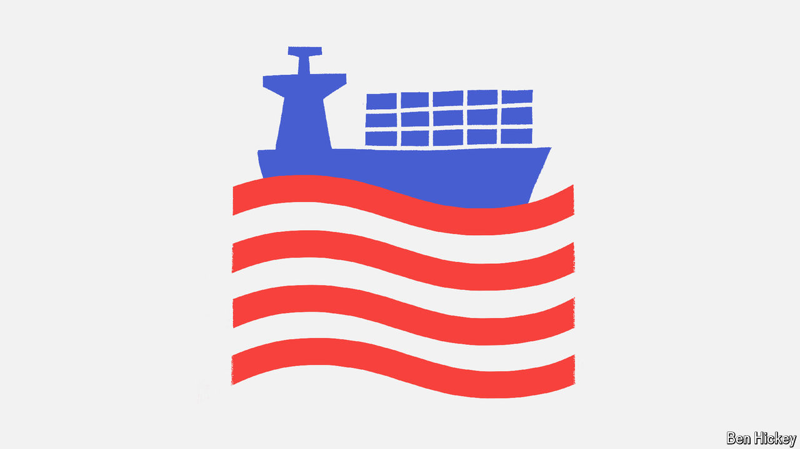

###### Policy brief

# What America’s presidential election means for world trade 

##### The first in a series of eight concise briefs on the consequences of the 2024 election 

 

> Oct 6th 2024 

In the 1990s presidential hopefuls fought over how much America should open itself up to commerce with other countries. Nowadays, the trade debate revolves around how much America should close itself off. Donald Trump is the more radical of the two candidates, with a vision for tariffs that would turn the clock back nearly a century on economic strategy. Kamala Harris is less extreme but still sees a world in which America is best served by soft protectionism, featuring subsidies for favoured industries.

