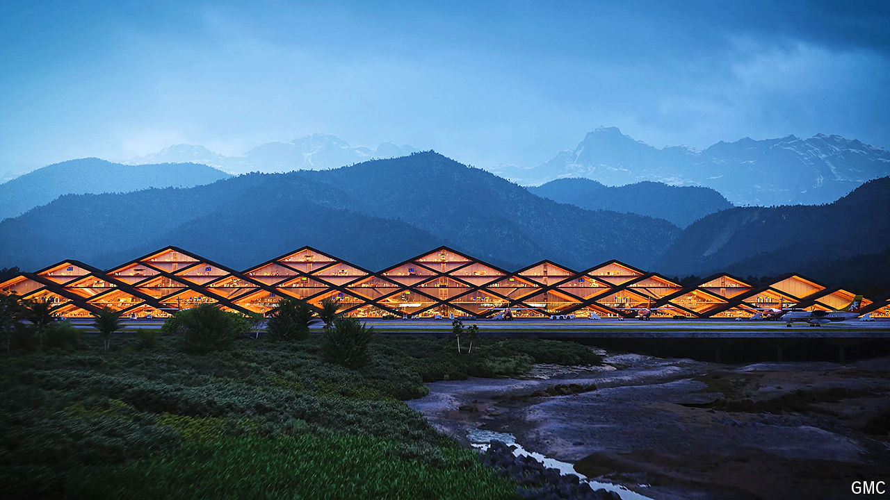

###### Big dreams in a small place

# Bhutan prays it can be India’s Hong Kong 

##### The Himalayan kingdom seeks to reincarnate as a financial centre 

 

> Oct 17th 2024 

King Jigme of Bhutan recalls that when he was studying in America, his classmates would scoff in disbelief when he told them there were tigers and elephants in his Himalayan homeland. Like many foreigners, they thought of it as a place of snow-clad peaks and alpine meadows. Even those who had visited were unlikely to have strayed to the subtropical lowlands that border north-east India. 

