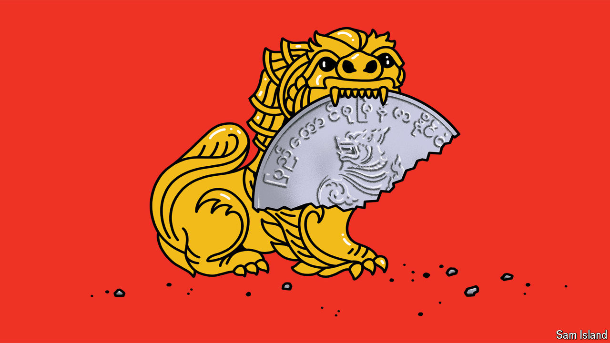

###### Banyan

# Myanmar’s military junta has conjured up a crazy currency system 

##### Desperate for cash, the Tatmadaw is distorting foreign-exchange markets 

 

> Oct 17th 2024 

The foreign-exchange market is a devilishly difficult place to turn a profit. Massive and closely watched, edges are impossible to maintain. Most FX traders lose money. So Banyan was impressed to encounter one Myanmar-based punter who, with just a few years’ experience, has managed to produce 22% returns trading the volatile, illiquid kyat, the local currency. Or, rather, he would be impressed—were this upstart trading against counterparties who had any say in the matter.

