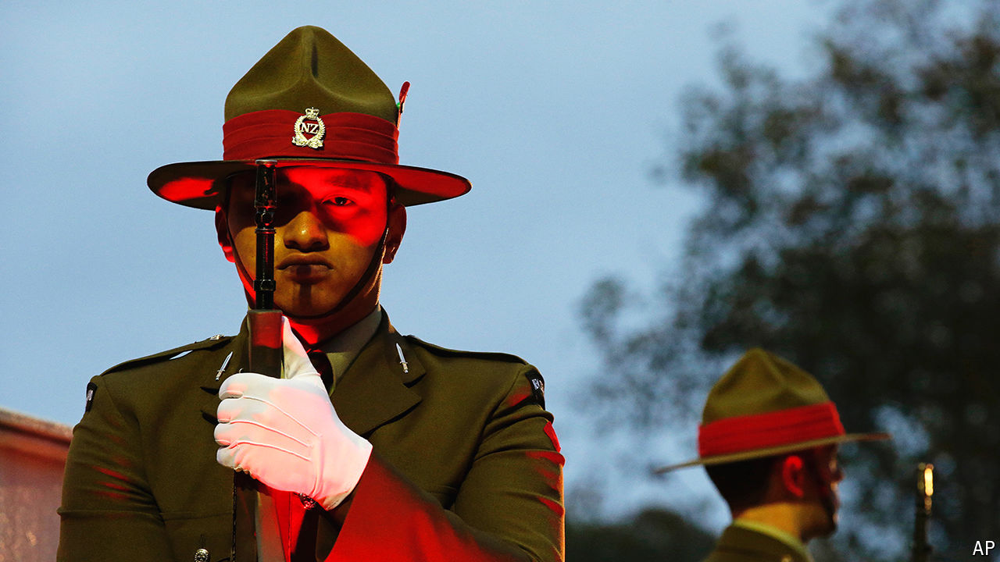

###### The fifth Five Eye

# New Zealand’s biggest pivot since the 1980s 

##### An interview with Christopher Luxon, the prime minister reshaping its foreign policy 

 

> Oct 17th 2024 

On September 25th the , one of just a handful of ships in the Royal New Zealand Navy, sailed through the Taiwan Strait alongside an Australian destroyer. The idea was to demonstrate to China that its claims to sole control of the waterway are invalid under international law. America does it several times a year, despite condemnations from China, sometimes with allies such as Canada. Australia does, too. New Zealand has not made such a bold move since 2017.

