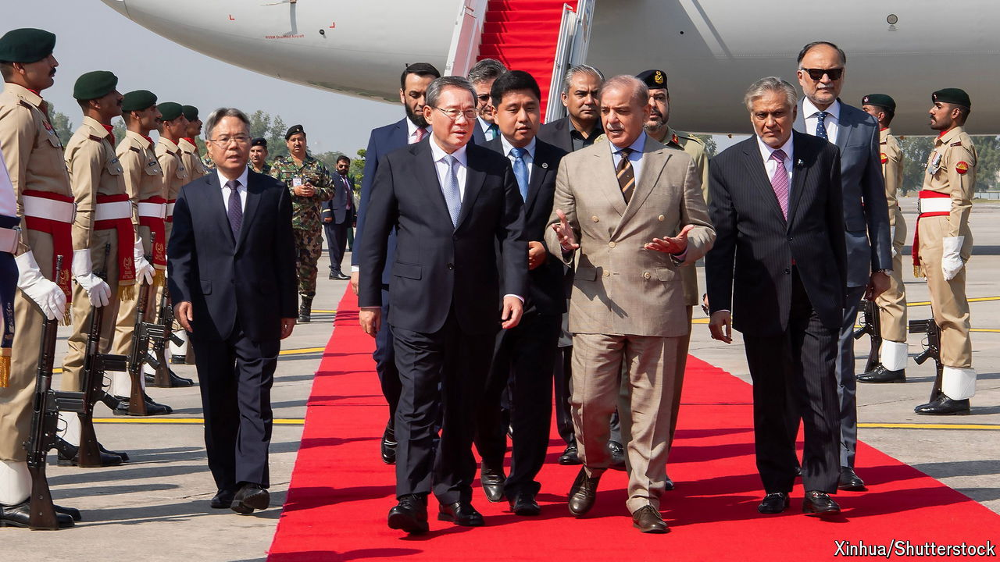

###### Stormy weather

# Pakistan rolls out the red carpet for China’s prime minister 

##### But the “all-weather strategic co-operative partnership” has hit a rough patch 

 

> Oct 17th 2024 

The suicide bomber’s video message is chilling and direct. “China, your interests are not welcome here. Your investments will be burned, your investments will not be safe,” he warns. On October 6th he struck, ramming an explosives-filled pickup truck into a convoy of Chinese workers outside the airport in Karachi. Two Chinese nationals were killed. The attack was claimed by the Baloch Liberation Army, a separatist group fighting the Pakistani state—and, increasingly, Chinese interests in Pakistan.

