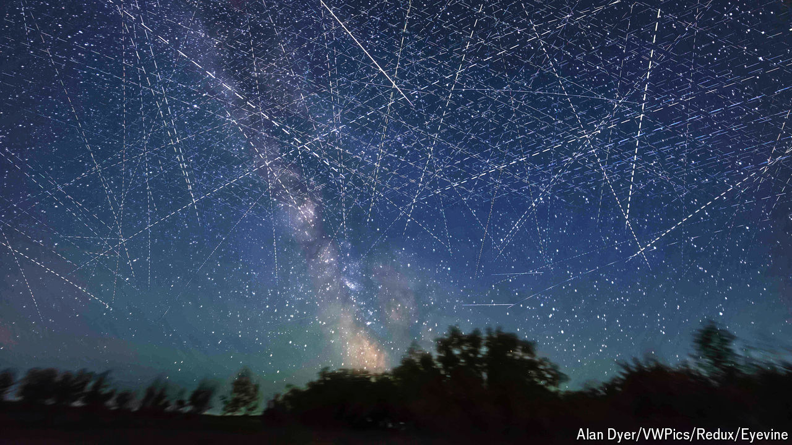

###### Filling up space

# The rockets are nifty, but it is satellites that make SpaceX valuable 

##### Elon Musk’s space venture may soon be more valuable than Tesla 

 

> Oct 17th 2024 

There was no mistaking the feat of engineering. The bottom half of the biggest object ever flown—by itself as tall as a 747 is long—came hurtling out of the sky so fast that it glowed from the friction. With the ground rushing to meet it, a cluster of its engines briefly relit, slowing the rocket and guiding it carefully back towards the same steel tower from which it had launched just seven minutes previously. A pair of arms swang closed to catch it, leaving it suspended and smoking in the early-morning sunshine.

