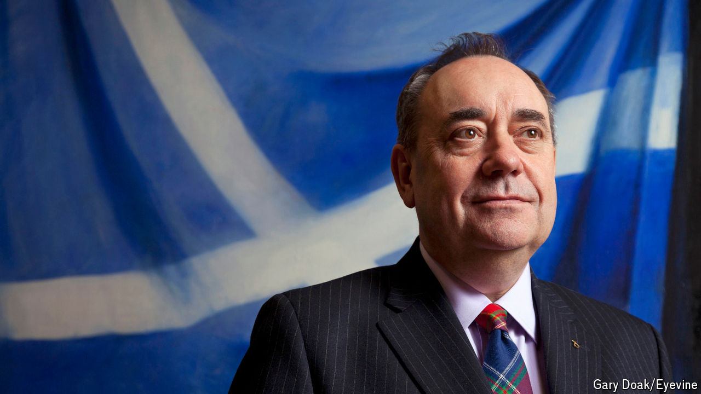

###### A shrunken giant

# Alex Salmond went from the fringes to the mainstream and back again 

##### The one-time figurehead of Scottish nationalism died on October 12th 2024 

 

> Oct 13th 2024 

“A monumental figure of UK and Scottish politics” was the tribute paid by Sir Keir Starmer, the prime minister, to Alex Salmond, who died on October 12th, aged 69. That is half-right. 

