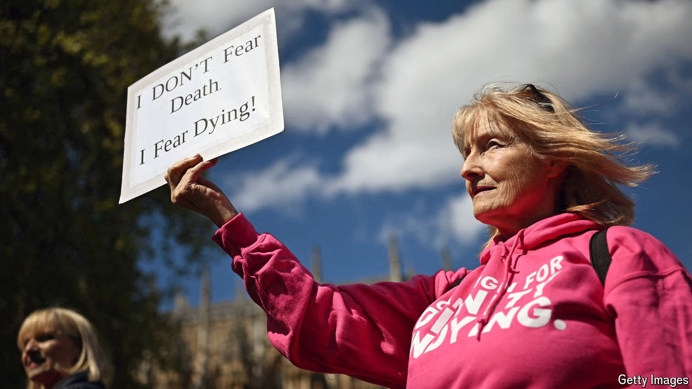

###### The right to die

# An assisted-dying bill is again introduced to Westminster 

##### This time there is a good chance it will pass 

 

> Oct 16th 2024 

ON October 16th, on a grey morning in Westminster, a gaggle of pink-clad campaigners with placards gathered in Parliament Square. “Kim Leadbeater MP: Thank you for giving us hope,” read one sign. Later that day, Ms Leadbeater, a Labour MP, introduced a bill in the House of Commons to allow  for the terminally ill in England and Wales. 

