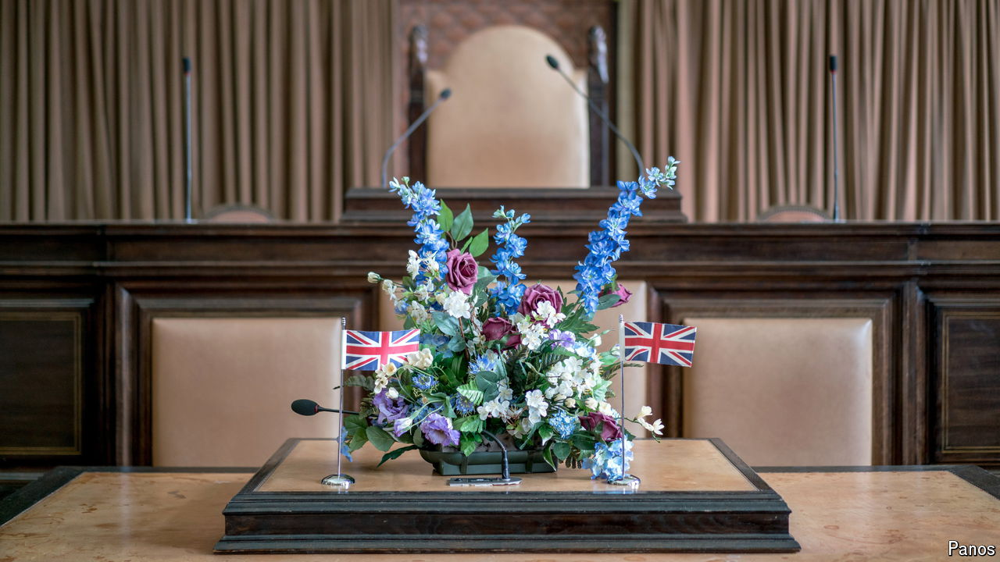

###### Testing times

# Could you pass the British citizenship test? 

##### If you’re a native-born Briton, almost certainly not 

 

> Oct 15th 2024 

The Battle of Hastings is not a bother. Almost all Britons would know, as the British citizenship test demands they should, both when it was fought (1066) and who won (William the Conqueror). Many might also manage Agincourt (1415, Henry V); a few could probably even get Bosworth Field (1485, Henry VII). But then the test, and the battles, get harder (Battle of the Boyne, anyone?). Other topics are even more of a struggle. How many Britons could confidently plot Bradford on a map? Or know what an “Ulster fry” is (a food? a crime?). Or be able to say who Kenneth MacAlpin was (a building magnate?). 

